# ANDROID PROCESS, PERMISSION, AND VULNERABILITY MANAGER (APVM)

## 1. Project Overview & Executive Summary

The **Android Process, Permission, and Vulnerability Manager (APVM)** is an Android cybersecurity application designed to provide a centralized platform for monitoring application processes, auditing application permissions, and identifying security vulnerabilities in Android applications.

Traditional Android security utilities often provide isolated functionality such as viewing application permissions, monitoring running applications, or performing APK analysis. APVM combines these capabilities into a single security-oriented platform.

The system provides seven major modules:

1. Security Dashboard
2. Android Process Manager
3. Permission Auditor
4. APK Security & Vulnerability Scanner
5. Security Risk Assessment
6. Security Report & Explanation
7. Scan History

The platform analyzes installed applications and user-selected APK files, identifies potentially risky permissions and insecure application configurations, evaluates detected security findings, and presents the results through understandable security reports.

APVM focuses primarily on **Android application security assessment, process monitoring, permission auditing, and static APK vulnerability analysis**.

---

# 2. Core Objectives

The primary objectives of APVM are:

- Provide a centralized security dashboard for Android applications.
- Monitor currently running application processes.
- Provide supported process-management capabilities.
- Audit permissions requested by installed applications.
- Identify dangerous and special-access permissions.
- Analyze APK files for insecure configurations and known vulnerability patterns.
- Identify exposed Android application components.
- Assign an overall security risk level.
- Explain security findings in an understandable manner.
- Maintain a history of previous APK security scans.

---

# 3. System Architecture

The system is divided into an Android client and an analysis backend.

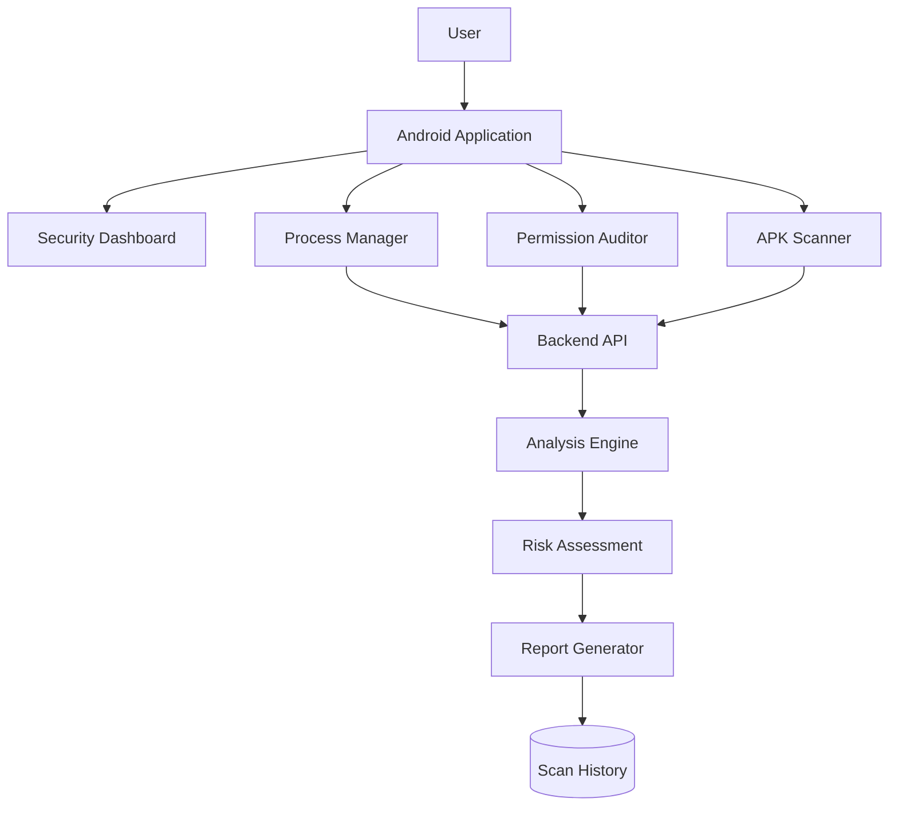

The Android application provides the user interface and device-level information, while the backend performs computationally intensive APK analysis and security evaluation where required.

---

# 4. Security Dashboard

The **Security Dashboard** is the central interface of APVM. It provides a high-level overview of the security state of applications and previously performed analyses.

## Features

- Display the overall device security overview.
- Display the number of installed applications.
- Display the number of currently running processes.
- Display applications using dangerous permissions.
- Display applications using special or potentially suspicious permissions.
- Display the number of detected APK vulnerabilities.
- Display the overall security status.
- Display the overall risk summary.
- Provide quick access to:
  - Android Process Manager
  - Permission Auditor
  - APK Security Scanner
  - Security Reports
  - Scan History
- Highlight applications requiring further security investigation.

## Dashboard Flow

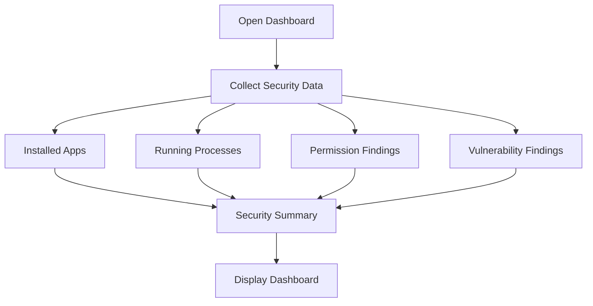

---

# 5. Android Process Manager

The **Android Process Manager** provides information about currently running application processes and provides supported process-management operations.

The module is intended to provide visibility into application activity while respecting Android's security and process-isolation restrictions.

## Process Monitoring

The module can:

- View currently running processes.
- Display process/application name.
- Display Process ID (PID), where available.
- Display process status.
- Display available CPU information.
- Display available memory/resource information.
- Identify the application associated with a process.
- Refresh the process list.
- Display basic process activity information.

## Process Management

Where supported by the Android version and available privileges, the module can:

- Select a process/application.
- Terminate supported processes.
- Put supported applications into a sleep state.
- Hibernate supported applications/processes.
- Identify applications with persistent background activity.

Operations requiring elevated privileges will only be available where the device configuration supports them.

## Process Manager Flow

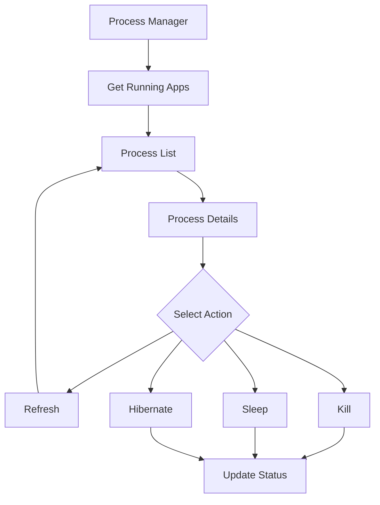

---

# 6. Permission Auditor

The **Permission Auditor** analyzes permissions requested by installed Android applications and categorizes them according to their potential security impact.

The purpose of the module is to provide contextual permission analysis rather than simply displaying a list of permission names.

## Permission Discovery

The module can:

- List permissions requested by installed applications.
- Group permissions by application.
- Display permission names.
- Display permission descriptions where available.
- Display the permission category or protection level.
- Identify permissions requiring special access.

## Permission Classification

Permissions can be classified into:

- Normal permissions
- Dangerous permissions
- Special-access permissions
- Other sensitive or less-obvious permissions

Examples include:

```text
READ_SMS
READ_CALL_LOG
RECORD_AUDIO
ACCESS_FINE_LOCATION
READ_CONTACTS
SYSTEM_ALERT_WINDOW
REQUEST_INSTALL_PACKAGES
```

## Permission Risk Analysis

The module can:

- Detect applications requesting multiple sensitive permissions.
- Identify potentially excessive permission usage.
- Identify special-access permissions.
- Highlight potentially risky permission combinations.
- Compare requested permissions with application functionality where sufficient information is available.
- Explain why a flagged permission may represent a security concern.

A permission alone does not prove that an application is malicious. The permission findings are treated as security indicators that contribute to the overall risk assessment.

## Permission Auditor Flow

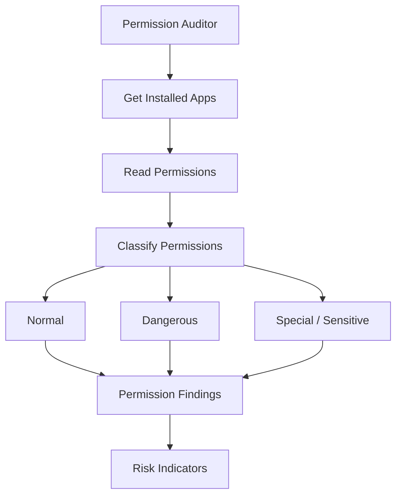

---

# 7. APK Security & Vulnerability Scanner

The **APK Security & Vulnerability Scanner** performs static security analysis on user-selected APK files.

The scanner examines APK metadata, the Android manifest, application components, permissions, and code/resources for known security weaknesses and vulnerable configurations.

## APK Input

The scanner supports:

- APK file selection/import.
- APK metadata extraction.
- Package name identification.
- Application version identification.
- APK structure inspection.

## AndroidManifest.xml Analysis

The scanner analyzes:

- Requested permissions.
- Activities.
- Services.
- Broadcast receivers.
- Content providers.
- Exported components.
- Component protection settings.
- Application configuration.

## Component Security Analysis

The scanner checks for potentially unsafe configurations involving:

### Activities

- Unnecessarily exported activities.
- Missing or weak protection mechanisms.

### Services

- Exported services without appropriate protection.
- Potentially unsafe service configurations.

### Broadcast Receivers

- Exported receivers.
- Receivers lacking suitable permission restrictions.

### Content Providers

- Exported providers.
- Potential unauthorized access.
- Potential data exposure.

## Static Code Analysis

The scanner may inspect application code and resources for known security issues such as:

- Unsafe WebView configurations.
- Insecure JavaScript interfaces.
- Unsafe local file access.
- Hardcoded sensitive information where detectable.
- Insecure coding/configuration patterns.
- Other predefined Android security rules.

## Vulnerability Classification

Detected findings can be categorized as:

```text
LOW
MEDIUM
HIGH
CRITICAL
```

Each finding should contain:

- Finding name.
- Severity.
- Affected component.
- Description.
- Evidence.
- Security impact.
- Recommended mitigation.

## APK Scanner Flow

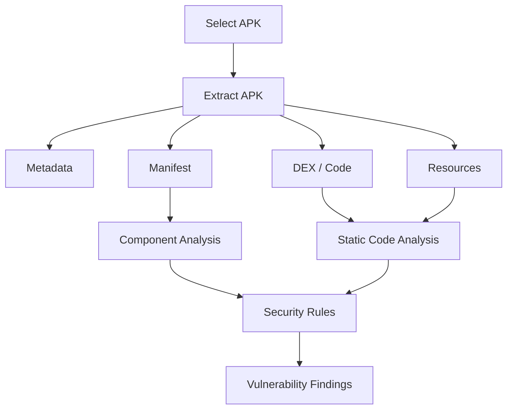

---

# 8. Security Risk Assessment

The **Security Risk Assessment** combines findings from the Permission Auditor and APK Security & Vulnerability Scanner to determine the overall security risk of an application or APK.

## Risk Factors

The assessment can consider:

- Number of sensitive permissions.
- Dangerous permissions.
- Special-access permissions.
- Potentially excessive permission combinations.
- Number of detected vulnerabilities.
- Vulnerability severity.
- Exported application components.
- Insecure configurations.
- Other static-analysis findings.

## Risk Levels

The system can categorize results into:

```text
LOW
MEDIUM
HIGH
CRITICAL
```

## Risk Assessment Functions

- Generate an overall risk level.
- Calculate a risk score.
- Identify applications requiring attention.
- Prioritize high-severity findings.
- Display the factors contributing to the risk.
- Associate individual findings with their risk contribution.
- Distinguish informational findings from serious vulnerabilities.

## Risk Assessment Flow

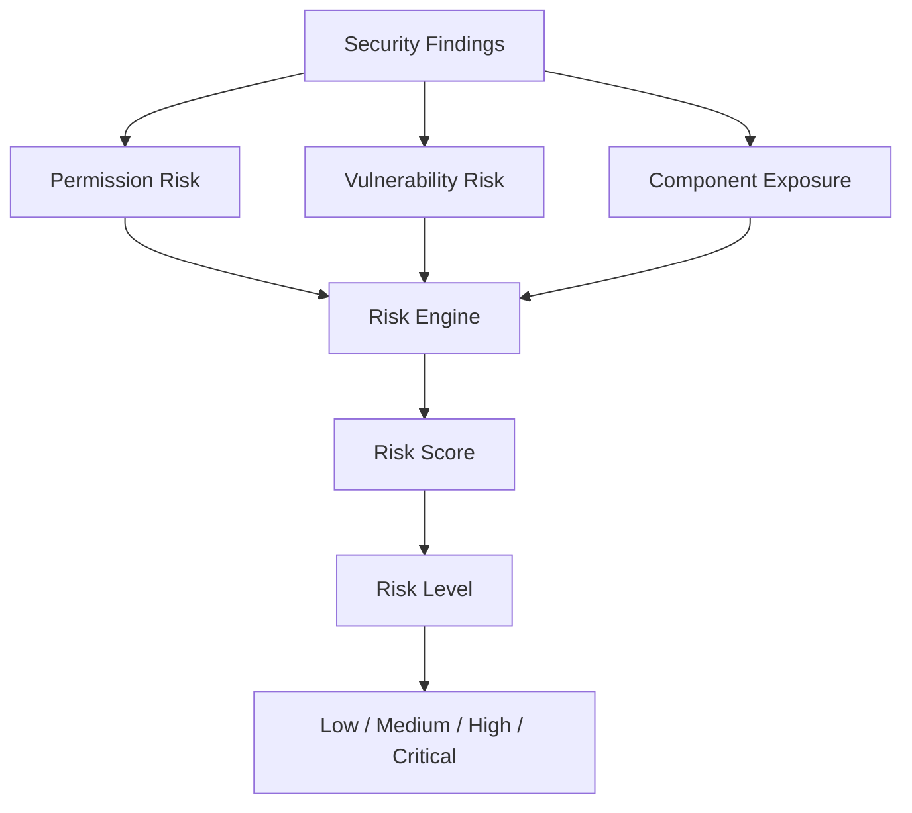

---

# 9. Security Report & Explanation

The **Security Report & Explanation** module converts technical security findings into an understandable report.

Instead of simply displaying a security score, APVM explains the findings and their potential impact.

## Report Information

### Application Information

- Application name.
- Package name.
- Version.
- APK information.
- Scan date and time.

### Permission Findings

- Requested permissions.
- Dangerous permissions.
- Special permissions.
- Potentially excessive permissions.
- Permission-related explanations.

### Vulnerability Findings

- Vulnerability name.
- Affected component.
- Severity.
- Evidence.
- Security impact.
- Recommended mitigation.

### Risk Summary

- Overall risk score.
- Overall risk level.
- Major contributing factors.
- High-priority findings.
- Security summary.

## Explanation Functions

The system explains:

- What was detected.
- Why it matters.
- What security risk it may create.
- Which component is affected.
- What can be done to mitigate the issue.

## Report Flow

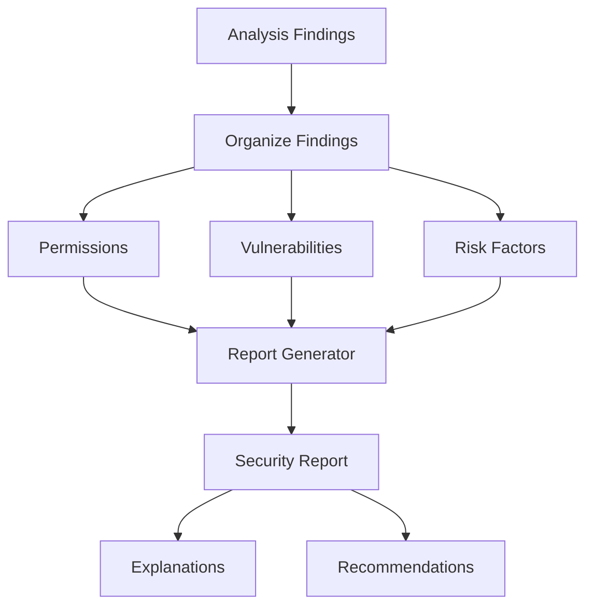

---

# 10. Scan History

The **Scan History** module stores previous APK security scans and allows users to review previous results.

It provides a chronological record of security assessments.

## Features

- Record previously scanned APKs.
- Store APK/application name.
- Store package name.
- Store scan date and time.
- Store scan result.
- Store detected vulnerabilities.
- Store permission-related findings.
- Store overall risk level.
- View previous scan details.
- Compare repeated scans.
- Identify changes between repeated scans.
- Delete old scan records.
- Maintain a chronological list of security assessments.

## Scan History Flow

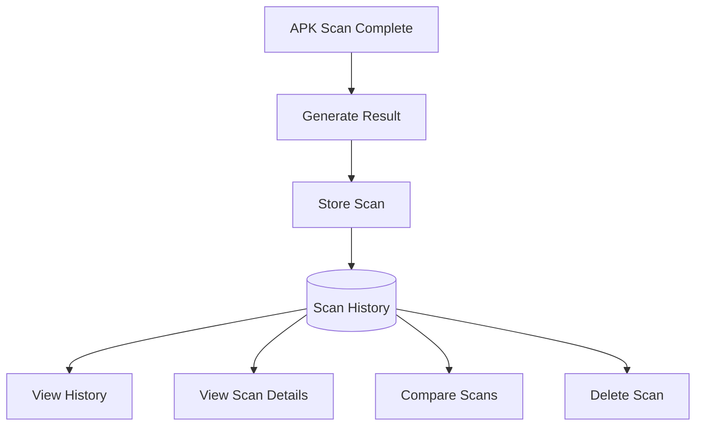

---

# 11. Overall Data Flow Diagram

The overall data flow of APVM connects application information, process monitoring, permission analysis, APK scanning, risk assessment, reporting, and scan history.

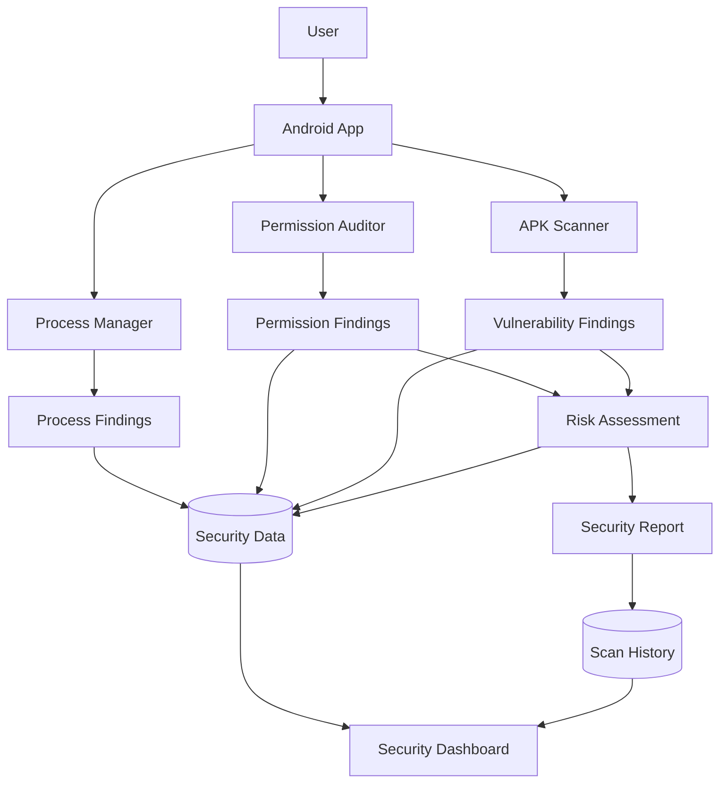

---

# 12. Detailed APK Security Analysis Data Flow

The APK scanning pipeline can be represented as follows:

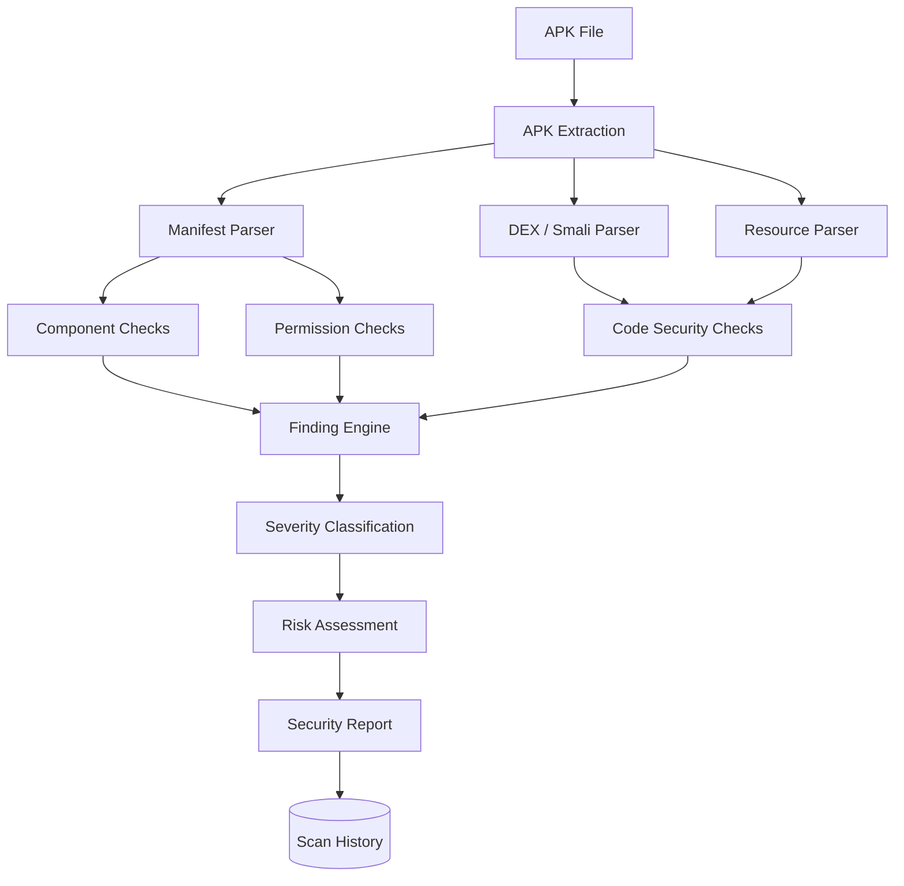

---

# 13. Integrated Application Workflow

The complete user workflow is:

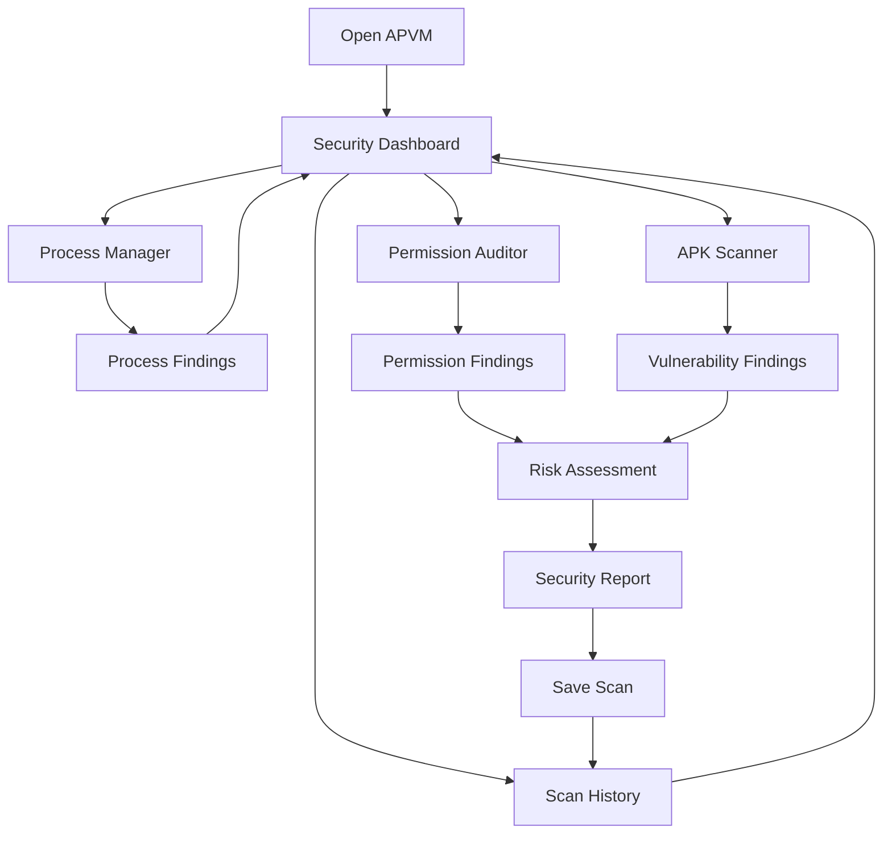

---

# 14. Backend Architecture

The backend provides APIs for communication between the Android application and the security-analysis engine.

## Technology Stack

### Android Client

- Kotlin
- Jetpack Compose
- Material Design
- Android PackageManager
- UsageStatsManager
- Android application/system APIs

### Backend

- Python
- FastAPI
- REST API
- JSON

### APK Analysis

- JADX
- Apktool
- Androguard
- AndroidManifest.xml parsing
- Smali/code static analysis

### Database

- SQLite for local development and prototyping.
- PostgreSQL for production-scale deployment.

## Backend Flow

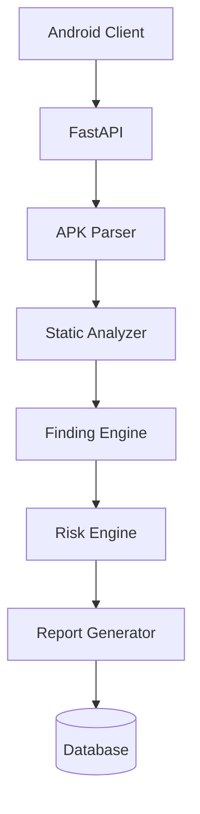

---

# 15. API Structure

The backend can expose the following REST API endpoints:

```text
/api/apps
/api/processes
/api/permissions
/api/upload
/api/analyze
/api/findings
/api/risk
/api/report
/api/history
```

### API Responsibilities

```text
/api/apps
→ Retrieve application information.

/api/processes
→ Retrieve process-related information.

/api/permissions
→ Retrieve permission information.

/api/upload
→ Receive an APK for analysis.

/api/analyze
→ Start APK security analysis.

/api/findings
→ Return detected security findings.

/api/risk
→ Generate or retrieve the security risk assessment.

/api/report
→ Generate the security report.

/api/history
→ Store and retrieve previous scan results.
```

---

# 16. Database Architecture

SQLite can be used during development, with PostgreSQL as a potential production database.

## Application Table

```text
APPLICATION
- application_id
- package_name
- application_name
- version
- installed_date
```

## Permission Table

```text
PERMISSION
- permission_id
- permission_name
- permission_category
- risk_level
```

## Application Permission Table

```text
APPLICATION_PERMISSION
- application_id
- permission_id
```

## APK Scan Table

```text
APK_SCAN
- scan_id
- package_name
- apk_name
- scan_timestamp
- risk_level
- risk_score
```

## Vulnerability Table

```text
VULNERABILITY
- vulnerability_id
- scan_id
- vulnerability_name
- affected_component
- severity
- description
- recommendation
```

## Scan History Table

```text
SCAN_HISTORY
- history_id
- scan_id
- timestamp
- result
```

---

# 17. Risk Scoring Model

The risk engine combines multiple security indicators.

A conceptual risk model is:

```text
Risk Score =
    Permission Risk
  + Vulnerability Risk
  + Component Exposure Risk
  + Severity Weight
```

For example:

```text
Dangerous Permission
        ↓
Permission Risk

Special Permission
        ↓
Permission Risk

Excessive Permission Combination
        ↓
Permission Risk

Exported Component
        ↓
Component Exposure Risk

Known Vulnerability
        ↓
Vulnerability Risk

High/Critical Finding
        ↓
Higher Severity Weight
```

The resulting score can be mapped to an overall security level:

```text
LOW
MEDIUM
HIGH
CRITICAL
```

The scoring weights should be finalized during implementation and validated using controlled test APKs.

---

# 18. Security Finding Structure

Each security finding should contain a consistent structure:

```text
Finding
├── Finding Name
├── Category
├── Severity
├── Affected Application
├── Affected Component
├── Evidence
├── Description
├── Security Impact
└── Recommendation
```

Example:

```text
Finding Name:
Exported Activity

Category:
Component Exposure

Severity:
HIGH

Affected Component:
MainActivity

Evidence:
Activity is exported without appropriate protection.

Security Impact:
Another application may be able to invoke the component.

Recommendation:
Restrict component exposure and apply appropriate access controls.
```

---

# 19. Testing Strategy

APVM should be tested using controlled applications and APKs with different security characteristics.

## Test Case 1 — Normal Application

```text
Input:
Application with standard permissions and secure configuration.

Expected Result:
Low-risk or informational findings.
```

## Test Case 2 — Dangerous Permissions

```text
Input:
Application requesting multiple dangerous permissions.

Expected Result:
Permission warnings and increased permission risk.
```

## Test Case 3 — Special Permissions

```text
Input:
Application requesting special-access permissions.

Expected Result:
Special-permission findings.
```

## Test Case 4 — Exported Components

```text
Input:
APK containing exposed activities/services/receivers/providers.

Expected Result:
Component exposure findings.
```

## Test Case 5 — Insecure WebView

```text
Input:
APK containing an insecure WebView configuration.

Expected Result:
Static-analysis security finding.
```

## Test Case 6 — Multiple Vulnerabilities

```text
Input:
APK containing several security weaknesses.

Expected Result:
Multiple findings and a higher overall risk level.
```

## Test Case 7 — Repeated Scan

```text
Input:
Same APK scanned multiple times.

Expected Result:
Results stored separately and available for comparison.
```

---

# 20. Implementation Roadmap

| Phase | Duration | Module | Deliverables |
|---|---|---|---|
| Phase 1 | Weeks 1–2 | Security Dashboard + Process Manager | Android project foundation, das
